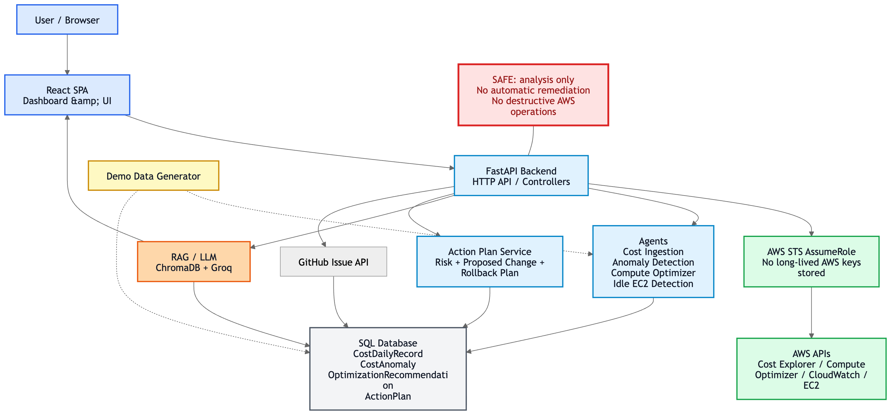

# CloudSentinel

CloudSentinel is an AWS FinOps platform for cloud cost anomaly detection, optimization recommendations, and human-reviewed remediation workflows.

CloudSentinel connects to AWS using secure AssumeRole access or runs in demo mode. It ingests daily cost data, detects unusual spending patterns using rolling baselines, imports Compute Optimizer findings, detects idle EC2 instances from CloudWatch metrics, and converts findings into reviewable ActionPlans. Approved ActionPlans can be converted into GitHub issues so teams can track remediation.

## Architecture overview

High-level flow (simplified):

AWS AssumeRole / Demo Mode → Cost Explorer ingestion → CostDailyRecord storage → Rolling-baseline anomaly detection → Compute Optimizer recommendations → CloudWatch idle EC2 detection → OptimizationRecommendation table → ActionPlan generation → GitHub issue creation

### Architecture diagram

The repository contains a rendered architecture diagram. If you're viewing this on GitHub the image below will show the system layout. If you prefer the raw Mermaid source it's available at `design/architecture.mmd`.



Key components:
- React frontend (single-page app)
- FastAPI backend (HTTP API + lightweight agents)
- SQLAlchemy models (SQLite for local dev, PostgreSQL supported)
- ChromaDB + Groq LLM for RAG-style assistant and evidence summarization
- Boto3 for AWS APIs (using STS AssumeRole)
- GitHub REST API for creating issues

The system intentionally does not perform destructive or automatic remediation. CloudSentinel focuses on analysis, evidence, and human-in-the-loop workflows. It produces recommendations and reviewable ActionPlans that can be converted to GitHub issues for engineering teams to act on.

## Features

What you get out of the box

CloudSentinel ships with these working features:

- Secure AWS AssumeRole connection (no raw AWS keys stored)
- Demo mode with seeded, deterministic AWS-like cost data for reproducible demos
- Cost Explorer daily cost ingestion (idempotent upserts)
- Rolling-window anomaly detection (7/30-day rolling baselines)
- CostAnomaly persistence and listing
- AWS Compute Optimizer integration (EC2 & EBS recommendations)
- CloudWatch-based idle EC2 detection agent
 - Normalized OptimizationRecommendation storage (idempotent)
 - ActionPlan generation from recommendations with metadata:
   - risk level (low/medium/high)
   - proposed change payload (structured JSON showing current vs recommended)
   - rollback guidance (human-readable notes)
   - approval_required flag
   - statuses: `pending_review`, `approved`, `dismissed`, `issue_created`
- GitHub issue creation from ActionPlans (optional; env-configured)
- RAG-powered cloud assistant / chat (using Groq + ChromaDB)
- React dashboard for visualizing recommendations, anomalies, and action plans
- Local SQLite fallback for easy development and testing

## What CloudSentinel does NOT do

Safety-first: what CloudSentinel will never do (today)

For safety and auditability, CloudSentinel currently does NOT perform any of the following:

- stop, terminate, or resize EC2 instances
- modify or delete EBS volumes
- mutate AWS resources in any way
- apply Terraform or generate Terraform PRs (planned for a future release)
- perform automatic remediation without human approval

To be clear: CloudSentinel only analyzes, recommends, stores evidence, and optionally creates GitHub issues for approved remediation workflows.

## Tech stack

Frontend:
- React 18
- Vite
- Tailwind CSS
- Recharts
- Lucide React

Backend:
- Python 3.10+
- FastAPI
- SQLAlchemy (SQLite/PostgreSQL)
- Boto3 (AWS SDK)
- ChromaDB + Groq LLM
- Pytest for tests

Cloud / APIs:
- AWS STS AssumeRole
- AWS Cost Explorer
- AWS Compute Optimizer
- AWS CloudWatch
- AWS EC2
- GitHub REST API

## Project structure

backend/
   agents/
      cost_analyzer.py
      cost_anomaly_agent.py
      compute_optimizer_agent.py
      idle_resource_agent.py
      orchestrator.py
   core/
      database.py
      aws_session.py
      llm_client.py
   routers/
      auth.py
      cost.py
      anomalies.py
      recommendations.py
      action_plans.py
      query.py
   services/
      cost_explorer_service.py
      action_plan_service.py
      github_service.py
   main.py

frontend/
   src/
      pages/
      components/
      config/

tests/
   test_cost_explorer.py
   test_anomalies.py
   test_compute_optimizer.py
   test_idle_resources.py
   test_action_plans.py
   test_github_issues.py

## Environment variables

Create a `.env` file in `backend/` (or set env vars in your shell). Key variables:

GROQ_API_KEY=your_groq_key_here

Optional database (defaults to SQLite if omitted):
DATABASE_URL=sqlite:///./cloudsentinel.db

Optional GitHub issue creation:
GITHUB_TOKEN=github_pat_or_token
GITHUB_REPO_OWNER=your-github-username-or-org
GITHUB_REPO_NAME=your-repo-name

Optional AWS real mode (AssumeRole):
No raw AWS access keys are stored. Real mode uses Role ARN + External ID through STS AssumeRole.

## Local setup

Backend (local dev)

```bash
cd backend
python -m venv venv
source venv/bin/activate
pip install -r requirements.txt
uvicorn main:app --host 127.0.0.1 --port 8000 --reload
```

If running from the repo root and Python imports fail, set PYTHONPATH:

```bash
export PYTHONPATH=$(pwd):$(pwd)/backend
uvicorn backend.main:app --host 127.0.0.1 --port 8000 --reload
```

Health check:

```bash
curl http://127.0.0.1:8000/health
```

Frontend:

```bash
cd frontend
npm install
npm run dev
```

Vite will usually start at http://localhost:5173 (it may pick 5174 if 5173 is in use).

## Demo mode quickstart

Demo mode — the quickest way to try it

Demo mode is the easiest way to try CloudSentinel without AWS credentials. Demo data is seeded deterministically so tests and demos are reproducible.

Create a demo AWS connection (the backend will return a demo connection id). This sets up a demo account in the system — no AWS access keys required:

```bash
curl -X POST http://127.0.0.1:8000/api/auth/aws/connect \
   -H "Content-Type: application/json" \
   -d '{}'
```

Ingest cost history and run anomaly detection (demo):

```bash
curl -X POST http://127.0.0.1:8000/api/cost/ingest-history \
   -H "Content-Type: application/json" \
   -d '{"connection_id": null, "days_back": 30, "run_anomaly_detection": true}'
```

Run a Compute Optimizer demo scan (generates deterministic recommendations):

```bash
curl -X POST http://127.0.0.1:8000/api/recommendations/compute-optimizer/scan \
   -H "Content-Type: application/json" \
   -d '{"account_id": "demo-123456789012"}'
```

Run an idle EC2 demo scan (CloudWatch-like metrics are simulated):

```bash
curl -X POST http://127.0.0.1:8000/api/recommendations/idle-resources/scan \
   -H "Content-Type: application/json" \
   -d '{"account_id": "demo-123456789012", "region": "us-east-1", "lookback_days": 14}'
```

List recommendations:

```bash
curl "http://127.0.0.1:8000/api/recommendations/history?account_id=demo-123456789012"
```

Create an ActionPlan from a stored recommendation (demo or real):

```bash
curl -X POST http://127.0.0.1:8000/api/recommendations/1/action-plan
```

List action plans:

```bash
curl "http://127.0.0.1:8000/api/action-plans?account_id=demo-123456789012"
```

Approve action plan:

```bash
curl -X POST http://127.0.0.1:8000/api/action-plans/1/approve
```

Dismiss action plan:

```bash
curl -X POST http://127.0.0.1:8000/api/action-plans/1/dismiss
```

Create a GitHub issue from an ActionPlan (requires GitHub env vars):

```bash
curl -X POST http://127.0.0.1:8000/api/action-plans/1/create-github-issue
```

## Real AWS mode setup

CloudSentinel uses AWS STS AssumeRole and does not store long-lived AWS keys.

Steps (high-level):

1. Create an IAM role in the target AWS account with permissions required by CloudSentinel (examples):
    - `ce:GetCostAndUsage`, `ce:GetCostForecast`, `ce:GetDimensionValues`
    - `compute-optimizer:GetEC2InstanceRecommendations`, `compute-optimizer:GetEBSVolumeRecommendations`
    - `ec2:DescribeInstances`
    - `cloudwatch:GetMetricStatistics`, `cloudwatch:GetMetricData`
    - `sts:GetCallerIdentity`
2. Configure the role trust policy to allow the CloudSentinel principal to assume the role and include an `ExternalId` if you want to enforce it.
3. Use the frontend or the `POST /api/auth/aws/connect` endpoint to store `role_arn` and `external_id` (the app stores role metadata, account id and connection status — it does NOT store raw AWS access keys).

The app will use STS AssumeRole at runtime to obtain short-lived credentials when making AWS API calls.

## GitHub integration setup

To enable GitHub issue creation, set the following environment variables in your `backend` environment:

GITHUB_TOKEN=your_personal_token_or_fine_grained_token
GITHUB_REPO_OWNER=owner
GITHUB_REPO_NAME=repo

Recommended token scopes (fine-grained):
- Issues: read & write
- Repository metadata (read)

Production-grade integration should use a GitHub App installation flow instead of a personal token — planned for a future release.

## API reference (compact)

Auth:
- POST /api/auth/aws/connect — create demo or real AWS connection
- GET /api/auth/status — connection status

Cost:
- POST /api/cost/ingest-history — ingest cost daily history (days_back, connection_id, run_anomaly_detection)
- GET /api/cost/history — list ingested daily costs

Anomalies:
- POST /api/anomalies/detect — run anomaly detection (optional)
- GET /api/anomalies/history — list detected anomalies

Recommendations:
- POST /api/recommendations/compute-optimizer/scan — run Compute Optimizer scan (account_id)
- POST /api/recommendations/idle-resources/scan — run idle EC2 detection (account_id, region, lookback_days)
- GET /api/recommendations/history — list recommendations

Action Plans:
- POST /api/recommendations/{recommendation_id}/action-plan — create an ActionPlan from a recommendation
- GET /api/action-plans — list ActionPlans
- POST /api/action-plans/{action_plan_id}/approve — approve an ActionPlan
- POST /api/action-plans/{action_plan_id}/dismiss — dismiss an ActionPlan
- POST /api/action-plans/{action_plan_id}/create-github-issue — create GitHub issue for an ActionPlan (requires GitHub env vars)

AI / Query endpoints (RAG + LLM)
- POST /api/query/chat — RAG-powered chat/query (if enabled and configured). This endpoint uses ChromaDB to retrieve evidence vectors and Groq LLM to summarize and answer natural language queries against your cloud evidence.

## Testing

From repo root (make sure imports work by setting PYTHONPATH):

```bash
export PYTHONPATH=$(pwd):$(pwd)/backend
pytest -q
```

Run targeted tests:

```bash
pytest -q tests/test_cost_explorer.py
pytest -q tests/test_anomalies.py
pytest -q tests/test_compute_optimizer.py
pytest -q tests/test_idle_resources.py
pytest -q tests/test_action_plans.py
pytest -q tests/test_github_issues.py
```

Tests use mocked/demo data and do not require real AWS or GitHub credentials.

## Troubleshooting

- Frontend port conflict (Vite): Vite may pick 5174 if 5173 is in use. Open the URL printed in the terminal or free the port:
   ```bash
   lsof -i :5173
   kill -9 <PID>
   ```
- Backend import errors: set PYTHONPATH from repo root:
   ```bash
   export PYTHONPATH=$(pwd):$(pwd)/backend
   ```
- Postgres unavailable: the app falls back to SQLite for local dev. Set `DATABASE_URL` to point at a Postgres instance for production.
- GitHub issue creation fails: verify `GITHUB_TOKEN`, `GITHUB_REPO_OWNER`, `GITHUB_REPO_NAME` and permissions.
- Compute Optimizer errors: ensure Compute Optimizer is enabled for the AWS account and required IAM permissions are present.

## Roadmap (short)

- Terraform PR generation (planned)
- GitHub App installation flow (replace PATs)
- Temporal / Celery async agent workflows
- WebSocket live scan status and agent progress
- Add S3 lifecycle & RDS rightsizing analysis
- Slack / Jira integration for action plan workflows
- Multi-account Organizations orchestration

## Interview / resume blurb

CloudSentinel demonstrates secure cloud identity (STS AssumeRole), robust cost ingestion, rolling-window anomaly detection, Compute Optimizer & CloudWatch analyses, idempotent recommendation pipelines, and human-in-the-loop remediation via ActionPlans and GitHub issues. The codebase is intentionally safe: it never mutates cloud resources automatically.

---

If you'd like, I can also open a draft pull request for branch `feature/compute-optimizer-v2` summarizing these changes and attaching the test results.
